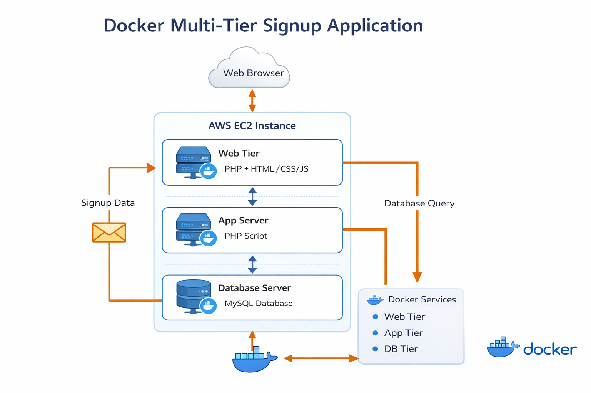
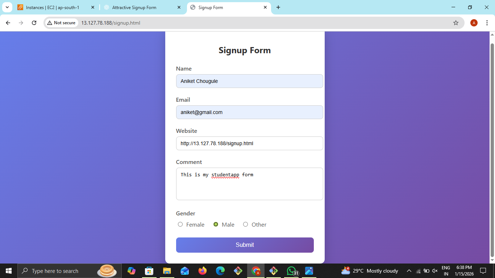
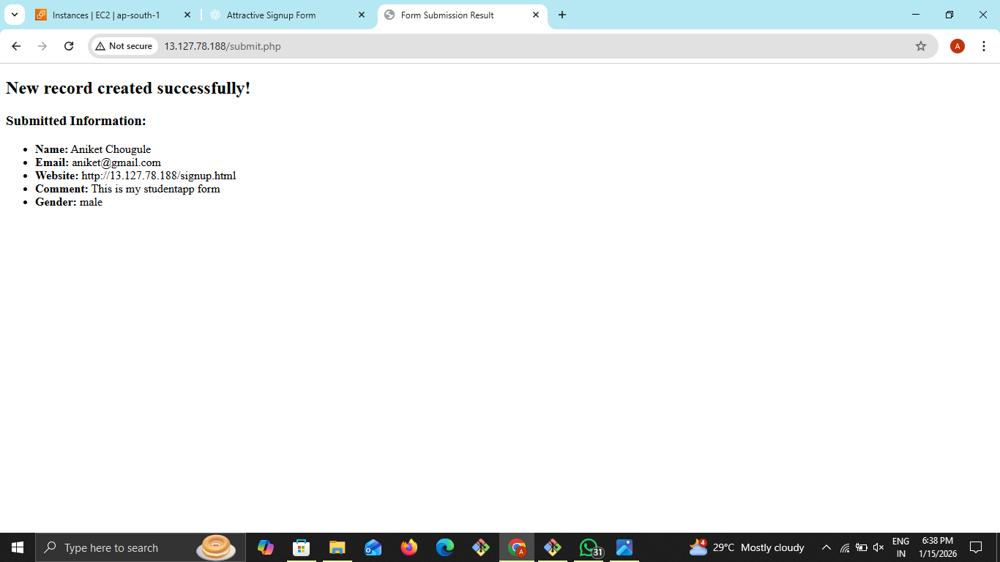
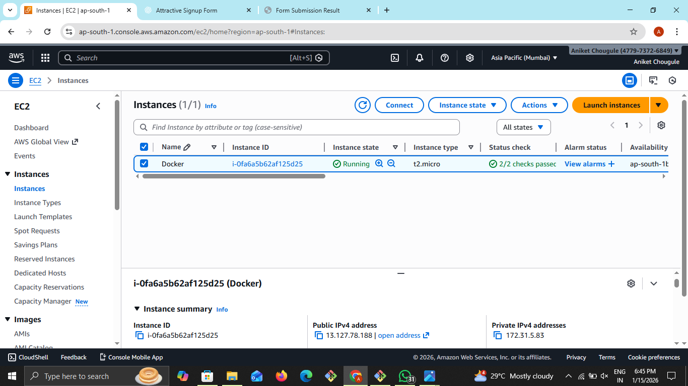
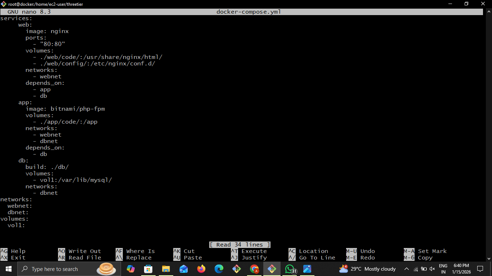
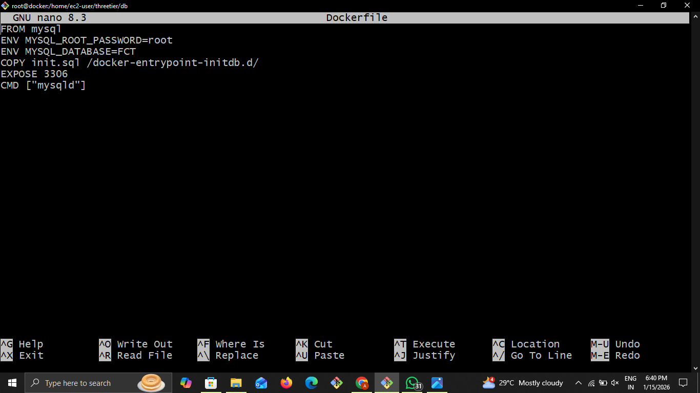

# Three-Tier Web Application with Database
## 📋 Project Overview
This project demonstrates a fully functional three-tier web application deployed using Docker containers on an AWS EC2 instance. The application follows industry-standard architecture by separating concerns into three independent layers:


1. **Presentation Layer (Web Container)** – Nginx
2. **Application Layer (Logic Container)** – PHP-FPM
3. **Data Layer (Database Container)** – MySQL
Users submit data via a web form, which is processed by PHP and securely stored in a MySQL database.

---

## 🏗️ Architecture Overview




### Key Benefits of This Architecture:
* Loose coupling between services
* Easy scalability of individual tiers
* Improved security by isolating database access
* Cloud-ready and containerized

---

## 🗂️ Project Structure

```
threetier/
├── docker-compose.yml          # Main orchestration file
├── app/
│   └── code/
│       └── submit.php          # PHP form processing script
├── db/
│   ├── Dockerfile              # Custom MySQL image
│   └── init.sql               # Database initialization script
└── web/
    └── config/
        └── default.conf       # Nginx configuration

```
---
### 🚀 Quick Start Commands

#### 1. Clone and Navigate to Project
```
cd /home/ec2-user/threetier
```
#### 2. Start the Application
```
docker-compose up -d
```
**Expected Output:**
```
[+] Running 3/3
Container threetier-db-1 Started
Container threetier-app-1 Started
Container threetier-web-1 Started
```
#### 3. Verify Running 
```
docker ps
```
**Expected Output:**

.png)

```
CONTAINER ID    IMAGE    COMMAND    CREATED    STATUS    PORTS    NAMES
3e1ae9f6bd4d    nginx    "/docker-entrypoint..."    13 seconds ago   Up 11 seconds  0.0.0.0:80->80/tcp, :::80->80/tcp   threetier-web-1
a30d7b60b050    bitnami/php-fpm    "php-fpm -F --pid..."    13 seconds ago   Up 12 seconds  9000/tcp    threetier-app-1
8daac627d62f    threetier-db    "docker-entrypoint.s…"    13 seconds ago   Up 12 seconds  3306/tcp   threetier-db-1
```
#### 4. Access Database
```
# Access MySQL container shell
docker exec -it threetier-db-1 /bin/bash

# Login to MySQL
mysql -u root -p
# Password: (as defined in docker-compose.yml)

# Use the database
use FCT;

# View submitted user data
select * from users;
```
---

### 📊 Database Operations
**View Submitted User Data**
```
mysql> use FCT;
mysql> select * from users;
```
### Sample Output:

---
### 1. Signup Form Page 


*User registration form with fields for name, email, website, comment, and gender.*

---
### 2. Form Submission Result

*Confirmation page showing successful form submission with user data.*

---
### 3. Database View

*Command-line view of the MySQL database showing stored user records.*

---
### 4. AWS EC2 Instance Management


*AWS EC2 dashboard showing running instances for this project.*

---
### 🔧 Configuration Files
**docker-compose.yml**



---
**Dockerfile**  



---
### 🌐 Accessing the Application
1. **Web Application URL:** http://34.227.74.125 (Public IPv4 address)
2. **Ports:**
     * Web Server: Port 80
     * Application: Port 9000 (internal)
     * Database: Port 3306 (internal)

---
### 📋 Prerequisites
* Docker Engine
* Docker Compose
* AWS EC2 Instance (for cloud deployment)
* Basic knowledge of MySQL and PHP

---
### 🛠️ Troubleshooting Guide
<!DOCTYPE html>
<html>
<head>
    <title>Docker Issues</title>
</head>
<body>

<h2>Docker Issues and Solutions</h2>

<table border="1" cellpadding="8">
    <tr>
        <th>Issue</th>
        <th>Solution</th>
    </tr>
    <tr>
        <td>Containers not starting</td>
        <td>docker-compose logs</td>
    </tr>
    <tr>
        <td>DB connection error</td>
        <td>Verify environment variables</td>
    </tr>
    <tr>
        <td>Port conflict</td>
        <td>Check security group and host ports</td>
    </tr>
    <tr>
        <td>Permission issues</td>
        <td>Validate volume mounts</td>
    </tr>
</table>

</body>
</html>

---
### 📈 Monitoring
The application includes:
* Container health checks
* Database connection pooling
* Nginx access/error logs
* MySQL query logging

---
### 🔒 Security Notes
* Database credentials are managed via environment variables
* Nginx is configured to only expose necessary ports
* PHP-FPM runs with appropriate user permissions
* Regular security updates for container images

---
### 👨‍💻 Author

**Aniket Chougule**  
Docker | DevOps | Cloud | Web Development